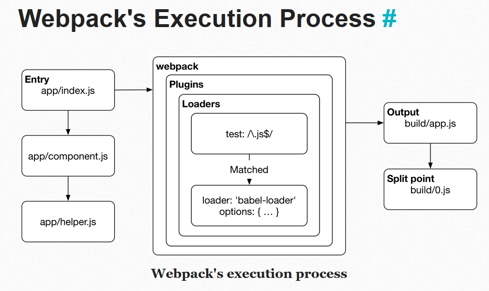

## Introduction
Bundlers take in various assets such as javascript, css and html, and transform them into a format that's convenient to consume through a browser.

Web browsers consume HTML, CSS, JS and multimedia files. As a project grows, tracking all of these files and adapting them to different targets (e.g. browsers) becomes too complicated to manage without help.

### Webpack
***
Webpack is a module bundler. It traverses the imports and constructs a **dependency graph** of the project and then generates **output** based on the configuration. Its also posibble to define **split points** to create separate bundles within the project code itself.
Internally webpack manages the bundling process using **chunks** , chunks are smaller pieces of code that are included in the bundles seen in webpack output.
Webpack supports ES2015, CommonJS, MJS, and AMD module formats out of the box. Plugins for specific tasks like minification, internationalization and HMR can be found as well.

#### Webpack's execution process
***

Webpack begins its work from **entries**. Often these are JS modules where webpack begins its traversal process. During this process, webpack evaluates entry matches against **loader** configurations that tell webpack how to transform each match.

#### Resolution process
***
An entry itself is a module and when webpack encounters one, it tries to match the module against the file system using resolve configuration. Eg, you can tell webpack to perform the lookup against specific directories in addition to node_modules.
If the resolution pass failed, webpack will raise a runtime error. If webpack managed to resolve a file, webpack performs processing over the matched file based on the loader definition. Each loader applies a specific transformation against the module contents. 
The same resolution process is performed against webpack's loaders. Webpack allows you to apply similar logic when determining which loader it should use. Loaders have resolve configurations of their own for this reason. If webpack fails to perform a loader lookup, it will raise a runtime error.
***
*Note :*
A dependency graph is a directed graph that describes how nodes relate to each other. In this case, the graph definition is defined through references (require, import) between files. Webpack statically traverses these without executing the source to generate the graph it needs to create bundles.
* * *